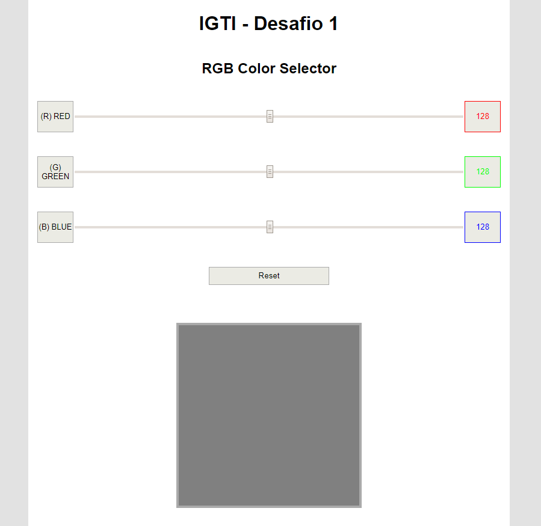

# IGTI BOOTCAMP FULLSTACK - Desafio 1

# Sobre o projeto
Construa, utilizando HTML, CSS e JavaScript puro, uma aplicação para a visualização de cores a partir da escala RGB.

# Usabilidade

# Dúvidas?
:mailbox_with_no_mail:[Marcelo Bonilla](https://www.linkedin.com/in/marcelobonilla/)
